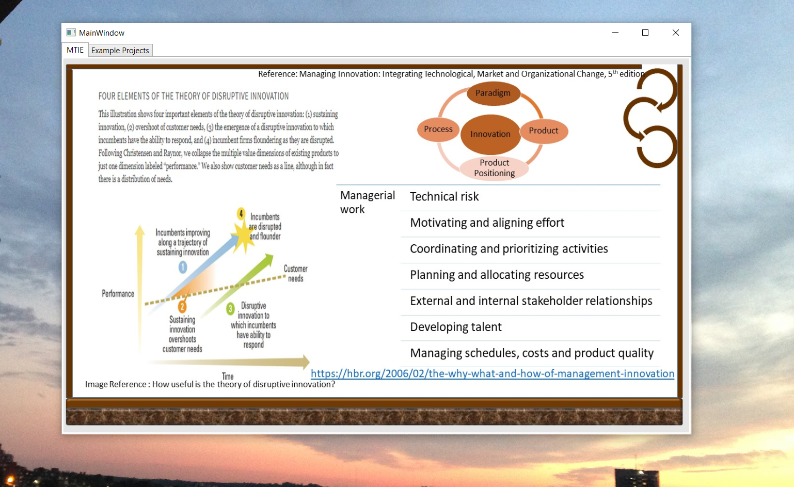
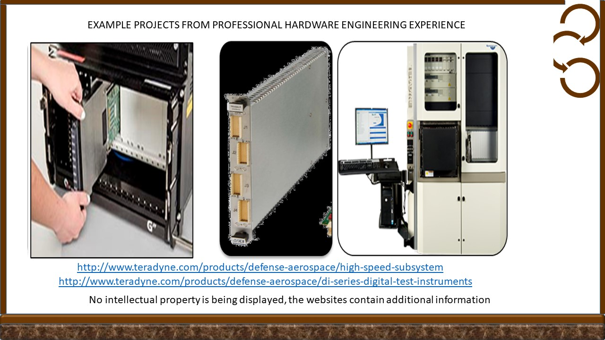

# Managing Technological Innovation

The project provides an example chart for disrputive innovation

Confidential information is not displayed.Images are custom or a reference name is provided.

## Disruptive innovation

## Ethics and Integrity

Further knowledge reference: https://github.com/alpaddesai/BusinessDevelopmentMergersAcquisitionsIdea
