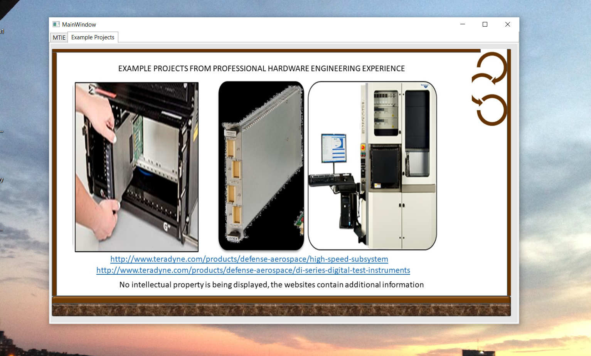
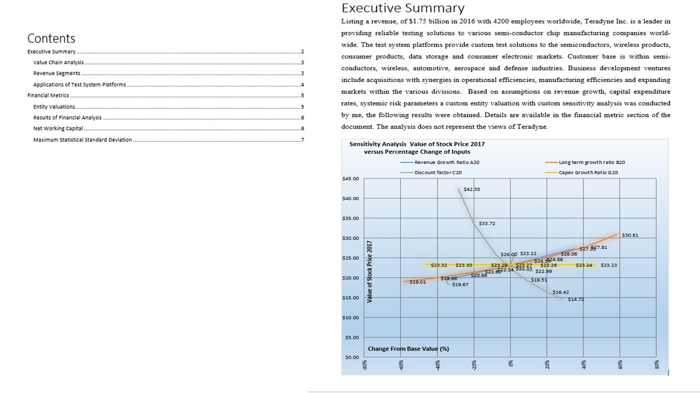
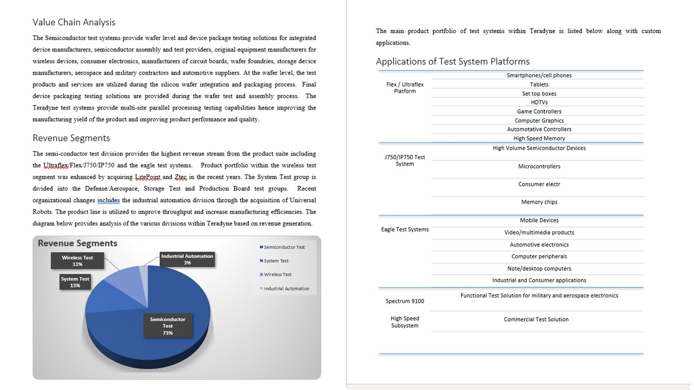

# Managing Technological Innovation

The project provides an example chart for disrputive innovation

Confidential information is not displayed.Images are custom or a reference name is provided.

Please download the executable in https://github.com/alpaddesai/ManagingTechnologicalInnovation/releases

## Disruptive innovation

## Examples of innovative projects (professional experience)

## Interest

Further knowledge reference: https://github.com/alpaddesai/NewProductDevelopmentProcesses
